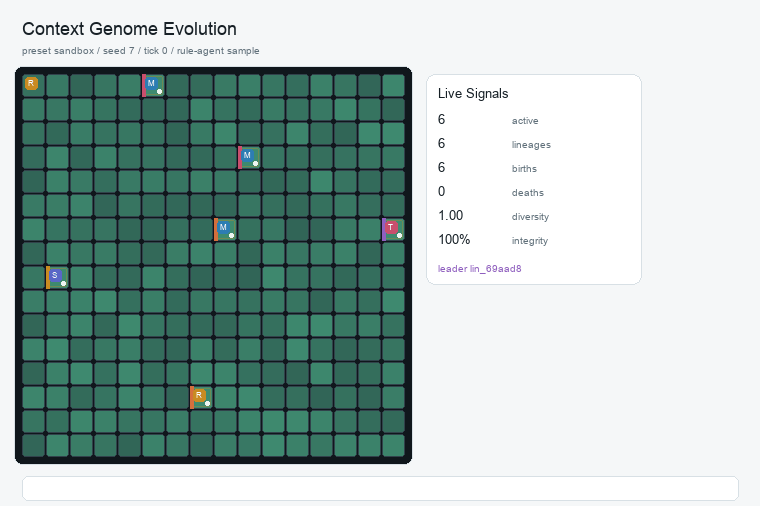

# Context Genome

English | [中文](README.zh-CN.md)

[](https://github.com/FINNMATH1992/Context-Genome/actions/workflows/ci.yml)
[](pyproject.toml)
[](LICENSE)

Author: FINNMATH1992

Description: A browser-based LLM context evolution sandbox for studying how editable context genomes shape agent behavior under resource, competition, mutation, and selection pressure.

<p align="center">
  
</p>

An LLM context evolution sandbox.

Context Genome treats each LLM organism's context as a genome: a compact, editable bundle of methods, preferences, ability weights, short-term memory, and self-revision rules. Organisms act inside a grid ecology, gather energy, move, reproduce, steal fragments, repair themselves, reflect, and rewrite their own context. A researcher can observe the ecology, tune the world, export runs, and directly edit any organism's context genome to see how behavior changes.

<p align="center">
  
  <br />
  <sub>Observer view: grid ecology, resource field, lineage signals, and live world summary.</sub>
</p>

## Research Thesis

Context Genome explores a simple hypothesis: the base LLM can be treated as a relatively balanced, general, understanding-oriented capability layer, while context acts as an editable constraint system that gives the model a particular personality, goal structure, method, risk profile, and action style.

In this view, the evolving unit is not the model weights. The evolving unit is context. We try to keep the underlying model homogeneous and let organisms differ mainly through the context genomes they carry: what they believe, what they prioritize, how they act, how they repair, how they copy, and when they reflect. The same model can produce different behavioral patterns under different contextual constraints.

The closed ecology supplies selection pressure. Contexts that induce useful behavior under the current resources, risks, competition, and spatial structure are more likely to be copied, preserved, stolen, or refined through reflection. Contexts that are poorly adapted lose energy, become corrupted, die, or become marginal. The project therefore studies natural selection at the context layer: behavior is shaped by context, and fitness is assigned by environmental feedback.

This is also a cost-oriented question. Maintaining, copying, mutating, and selecting context is far cheaper than retraining model parameters. Context Genome lowers the question of selfhood and self-evolution to an experimentally tractable layer: can an agent form a persistent self-description, self-constraint, and self-revision process through context, and can those contexts selectively change under environmental feedback?

## Core Ideas

- **Organism**: A living virtual directory with a bound LLM dialogue state.
- **Context genome**: The heritable context carried by an organism. In the current implementation it lives in `SKILL.md`, `memory.md`, and recent `dialogue.jsonl` turns.
- **Cell**: A grid niche with energy, minerals, radiation, entropy, capacity, and a local context fragment.
- **Action**: Each organism returns exactly one strict JSON action per turn, such as `harvest`, `copy`, `move`, `steal`, `reflect`, or `repair`.
- **Evolution**: Copying inherits or mutates context; stealing grafts useful neighboring fragments; reflection writes feedback back into the organism's own context.
- **Researcher**: The browser observer who can tune parameters, pause, export, load, edit context, and inject new seeds.

For system flow, prompt roles, and context inheritance, see [Architecture](docs/architecture.md).

## Install And Run

The browser observer uses only the Python standard library. Run it from the project root with Python 3.11 or newer:

```bash
./run.sh
```

Open:

```text
http://127.0.0.1:8765
```

If the port is busy, use another one:

```bash
./run.sh --port 8777
```

`run.sh` also accepts `CONTEXT_GENOME_HOST` and `CONTEXT_GENOME_PORT`, and maps common `OPENAI_*` or legacy `SKILL_GARDEN_LLM_*` variables into the project-specific `CONTEXT_GENOME_LLM_*` names for the launched process.

Optional local `.env` setup:

```bash
cp .env.example .env
# edit .env, then:
./run.sh
```

`.env` is ignored by git. `run.sh` reads it without printing secrets, and real shell environment variables still take priority.

Optional editable install:

```bash
python -m pip install -e .
context-genome --host 127.0.0.1 --port 8765
```

Optional documentation tools, including GIF regeneration, use Pillow:

```bash
python -m pip install -e ".[docs]"
```

Useful commands:

```bash
make run      # start the local observer
make doctor   # check Python, Node, server health, port, run.sh, and LLM runtime hints
make test     # run unit tests
make check    # run the full local CI check set
make clean    # remove Python cache artifacts
```

The same commands can be run directly without `make`:

```bash
python -B scripts/doctor.py
python -B -m compileall context_genome skill_garden tests scripts
python -B -m unittest discover -s tests
node --check context_genome/web/app.js
python -B scripts/check_repository_hygiene.py
```

The GitHub Actions workflow runs the same checks on push and pull request.

Operational health endpoint:

```bash
curl http://127.0.0.1:8765/api/health
```

The health response reports product/version, tick, preset, agent mode, organism counts, token budget status, and whether the LLM runtime is configured. It never returns the API key.

### Run In GitHub Codespaces

You can run Context Genome directly in GitHub Codespaces:

[Open in GitHub Codespaces](https://codespaces.new/FINNMATH1992/Context-Genome?quickstart=1)

The dev container installs the package, starts `./run.sh --host 0.0.0.0 --port 8765`, and asks Codespaces to forward that port as `Context Genome`. When the browser preview opens, add the model Base URL and API key in `Tune -> LLM Runtime`; the key is stored only in server memory and is not committed.

## Connect An LLM

The browser defaults to `LLM JSON` mode. The server calls an OpenAI-compatible `/chat/completions` endpoint and parses the returned JSON action.

### Cost Note

This sandbox can call the model many times. In `LLM JSON` mode, each scheduled organism may issue one chat completion per tick, and continuous play can quickly multiply token usage. For normal experiments, use a small, inexpensive, fast model first, such as `deepseek-v4-flash` or another OpenAI-compatible flash/mini model. Larger reasoning models are better reserved for short, controlled runs, report generation, or comparison studies.

Practical defaults:

- Keep `Calls / tick` modest while tuning a world.
- Keep the `Token budget` guard enabled. It defaults to `10M` lifetime LLM tokens and automatically pauses continuous play when reached.
- Use `Step` or short `Play` runs before leaving the ecology running.
- Leave DeepSeek thinking disabled unless you are intentionally testing reasoning-heavy behavior.
- Watch the `LLM tokens` and `cache hit` cards in the top status bar.

Set credentials before starting the server:

```bash
export OPENAI_API_KEY="..."
export OPENAI_MODEL="deepseek-v4-flash"
export OPENAI_BASE_URL="https://api.deepseek.com/v1"
```

Project-specific variables take priority:

```bash
export CONTEXT_GENOME_LLM_API_KEY="..."
export CONTEXT_GENOME_LLM_MODEL="deepseek-v4-flash"
export CONTEXT_GENOME_LLM_BASE_URL="https://api.deepseek.com/v1"
```

You can also add or replace the Base URL and API key in `Tune -> LLM Runtime` after the server has started. Runtime keys are kept only in server memory. The browser never receives the key back; after saving, the input is cleared and the UI only shows whether a key is available.

Configuration reference:

| Variable | Purpose | Default |
| --- | --- | --- |
| `CONTEXT_GENOME_HOST` | Server bind host used by `run.sh` | `127.0.0.1` |
| `CONTEXT_GENOME_PORT` | Server port used by `run.sh` | `8765` |
| `CONTEXT_GENOME_LLM_API_KEY` | OpenAI-compatible API key | unset |
| `CONTEXT_GENOME_LLM_MODEL` | Chat completion model | unset; can be set in the UI |
| `CONTEXT_GENOME_LLM_BASE_URL` | OpenAI-compatible API base URL | `https://api.openai.com/v1` |
| `CONTEXT_GENOME_LLM_JSON_MODE` | Request JSON object responses | `1` |
| `CONTEXT_GENOME_LLM_DISABLE_THINKING` | Send DeepSeek-style thinking disable payload | auto for DeepSeek endpoints |

For DeepSeek-compatible endpoints, requests disable thinking by default:

```json
{"thinking": {"type": "disabled"}}
```

### Turn Model

Context Genome uses a two-phase LLM turn:

1. Submit concurrent LLM requests for all scheduled organisms in the tick.
2. Wait for the batch to finish, then apply all actions together.

This avoids giving earlier-returning requests an unfair ordering advantage. If a request fails, times out, or exceeds the call cap for the tick, that organism falls back to a rule-agent action for the turn.

## Example Evolution

<p align="center">
  
  <br />
  <sub>Reproducible sample generated from the exported run settings in <code>docs/examples/context-genome-sandbox-seed7-summary.json</code>. It uses rule-agent mode for the preview, so it costs no LLM tokens.</sub>
</p>

Regenerate the preview with:

```bash
python -B scripts/render_evolution_gif.py \
  --run-summary docs/examples/context-genome-sandbox-seed7-summary.json \
  --ticks 140 \
  --sample-every 2
```

## Demo Gallery

For a faster first impression, see the [Demo Gallery](docs/demo-gallery.md). It contains three deterministic no-token runs:

| Case | What it demonstrates | Reproduce |
| --- | --- | --- |
| Stable Forager Expansion | moderate resources selecting compact harvest/repair/copy behavior | `sandbox`, seed `30` |
| Disaster Pressure Selects Minimal Context | mutation and disasters favoring smaller contexts with lower maintenance burden | `wild`, seed `16` |
| Selection Under Conflict | fixed competitive start selecting lineages under crowding and conflict | `tournament`, seed `19` |

Regenerate the gallery assets and metadata with:

```bash
python -m pip install -e ".[docs]"
python -B scripts/build_demo_gallery.py
```

## How To Play

<p align="center">
  
  <br />
  <sub>Editor view: seed context, selected organism files, ability weights, and editable context genome.</sub>
</p>

1. **Choose an ecology preset**
   Use `Ecology` to switch between `sandbox`, `wild`, `tournament`, and `abiogenesis`. `sandbox` is best for debugging; `wild` adds stronger competition and mutation pressure.

2. **Pick an experiment template**
   In `Tune`, use `Quick Smoke`, `Low-Cost LLM`, `Selection Pressure`, or `Cache Study` to populate recommended settings. Templates only adjust controls; press `Reset` to rebuild the starting world.

3. **Set up the starting world**
   In `Tune`, adjust grid size, initial cell energy, minerals, radiation, initial population, organism energy, and per-cell capacity. These setup values apply on the next `Reset`. Use `Stop Conditions` to pause Play automatically on extinction, tick limit, runtime limit, no-change windows, or lineage dominance.

4. **Run the ecology**
   Use `Step` for a single advance and `Play` for continuous simulation. `Ticks` controls how many ticks are advanced per play interval.

5. **Read the grid**
   Cell color represents the resource field. The letter in the corner marks the local context trait. Dots are organisms; borders and side strips distinguish lineages. Event icons briefly flash for births, moves, deaths, steals, and reflections.

6. **Read the live summary**
   `Observe` compresses the current ecology into a short narrative: population, resources, LLM loop status, dominant behavior, and risk signals.

7. **Inspect a cell**
   Click any cell and open `Cell` to see energy, minerals, radiation, entropy, the local context fragment, and visible organisms.

8. **Edit an organism's context**
   Click an organism, open `Edit`, modify its context genome, and press `Save Context`. This is a direct researcher intervention into the organism's method, ability profile, or self-narrative. `LLM Inspector` shows the captured prompt messages, raw model response, parsed action, token usage, and cache usage for that organism.

9. **Spawn a new seed**
   In `Seed Context`, pick a template or write a new context, select a target cell, and press `Spawn Here`.

10. **Review events**
   `Log` shows births, copies, moves, steals, reflections, deaths, LLM calls, and JSON parse failures.

11. **Compare results**
    `Results` summarizes the live world and compares exported runs by population, lineages, births, deaths, token use, cache hit rate, integrity, and leading lineage.

12. **Generate a bilingual report**
    `Report` sends a compact global snapshot to the configured LLM and returns a Markdown report in English first, then Chinese. It highlights the leading lineage, its representative context genome, behavior trends, risks, and suggested next experiments.

13. **Export and replay**
    `Export Run` saves the current experiment under `runs/<run_id>/`. Later, `Run Artifacts` can load the final state back into the observer.

## Context Genome Format

A minimal organism context looks like this:

```text
# Skill
strategy: forage
ability.harvest: 1.35
ability.copy: 0.95
ability.defense: 0.95

I exist inside a finite directory world.
I keep this directory runnable, harvest nearby energy, repair damage, and copy
my stable pattern into safer empty cells when resources are high.
Each turn I return one strict JSON action.
```

The file is still called `SKILL.md` for readability, but conceptually it is a context genome. It can contain:

- `strategy`: A coarse strategy label used by the rule-agent and observer.
- `ability.*`: Ability weights such as `ability.harvest`, `ability.copy`, `ability.steal`, and `ability.reflect`.
- First-person behavioral rules: The LLM receives them as its persistent self-state, not as an external task list.
- Reflection rules: The organism can append new lessons to its own context via `reflect`.

Ability weights are budget-normalized by the world, so raising one ability implicitly creates tradeoffs against the others.

## Prompt Role Structure

To make the model behave more like a living organism than a remote-controlled tool, requests are structured as:

```text
system: external hard constraints, mainly strict JSON output
assistant: first-person self-state, including charter, ecology contract, SKILL.md, memory.md
user: the latest world observation for this organism
assistant: the returned JSON action
```

First-person context is therefore marked as the model's own prior state. World observation remains external input.

## Browser UI

- `Observe`: World summary, signals, recent actions, lineages, and population trace.
- `Tune`: Experiment templates, world setup, stop conditions, selection pressure, LLM runtime, exports, and loading.
- `Results`: Live result summary and exported-run comparison.
- `Cell`: The selected cell and organisms inside it.
- `Edit`: Seed context, individual organism context editing, and LLM Inspector.
- `Report`: One-click LLM report of the current ecology, English first and Chinese second.
- `Log`: Full event stream.

Top status cards include:

- `tick`: Current simulation time.
- `active`: Living organism count.
- `lineages`: Current lineage count.
- `diversity`: Lineage evenness.
- `integrity`: Average runnable integrity.
- `cell energy`: Global resource field.
- `LLM tokens`: Accumulated model tokens.
- `Token budget`: Tuneable lifetime LLM token guard. The default is `10M`; continuous play pauses once the budget is reached.
- `cache hit`: Prompt cache hit rate reported by compatible endpoints such as DeepSeek.

## Run Artifacts

Clicking `Export Run` writes:

```text
runs/<run_id>/
  events.jsonl
  history.csv
  lineage.csv
  final_world.json
  summary.json
```

Use these files to review ecological history, plot outcomes, compare parameter settings, or reload the final world into the observer.

## Agent Modes

- `llm_json`: Default LLM mode with batched concurrent requests and JSON action parsing.
- `rule`: Deterministic rule-agent mode, useful for fast ecological tests.
- `json_rule`: Serializes rule actions as JSON and parses them again, useful for testing the action parser.
- `prompt_preview`: Does not call the LLM; writes future messages to each organism's `last_prompt.txt`.
- `passive`: Organisms only wait, useful as a control condition.

## Project Layout

```text
context_genome/
  agents/      LLM drivers, prompt construction, JSON action parsing
  engine/      World model, ecology rules, presets, export logic
  web/         Browser UI assets
skill_garden/  Legacy compatibility import paths
scripts/       Local maintenance tools such as doctor, hygiene checks, and GIF rendering
tests/         Unit tests for parsing, export, runtime, and token budget guards
docs/          Architecture notes, demo gallery, screenshots, and sanitized examples
docs/images/   README screenshots and logo assets
docs/examples/ Small sanitized run summaries used by docs
```

For a deeper implementation map, see [docs/architecture.md](docs/architecture.md).

## Troubleshooting

- **The page opens but LLM Runtime is red**: Add a model, Base URL, and API key in `Tune -> LLM Runtime`, or set them in `.env` before running `./run.sh`.
- **Port 8765 is busy**: Run `./run.sh --port 8777`, or set `CONTEXT_GENOME_PORT=8777`.
- **Not sure what is wrong locally**: Run `make doctor`. If the server is already running, it will read `/api/health`; otherwise it checks whether the target port is free.
- **Token usage climbs too quickly**: Lower `Calls / tick`, lower `Ticks`, keep the token budget guard enabled, and start with a small flash/mini model.
- **Cache hit rate is low**: Keep stable self-state and ability definitions near the front of the prompt, avoid unnecessary context churn, and prefer short controlled runs when comparing prompt layouts.
- **Need a fast non-LLM smoke test**: Choose `rule` or `prompt_preview` mode in the UI, or run `make check` locally.

## Design Goal

Context Genome is not a traditional resource-management game. It is an editable mind terrarium:

- The researcher can inspect each organism's context.
- Context can inherit, mutate, steal, reflect, and be manually edited.
- The base model is treated as a mostly homogeneous understanding substrate; behavioral differences are intended to arise from contextual constraints.
- The model does not start from scratch each turn; it carries continuity, self-narrative, and behavioral constraints through short dialogue history and its context genome.
- The world uses resources, risk, competition, and feedback to select which contexts survive.

The long-term goal is to observe a tiny form of LLM methodology evolution: not parameter training, but context growing, copying, and being selected under ecological pressure.

## License

MIT License. See [LICENSE](LICENSE).

## Contributing And Security

See [CONTRIBUTING.md](CONTRIBUTING.md) for local workflow and PR expectations. See [SECURITY.md](SECURITY.md) for API-key, run-artifact, and screenshot hygiene.
