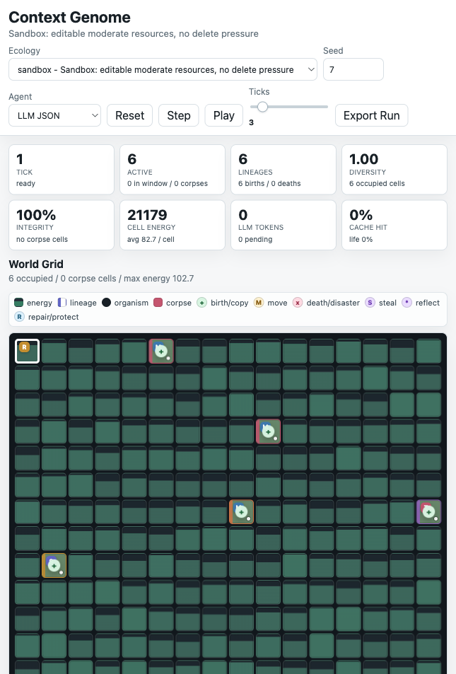
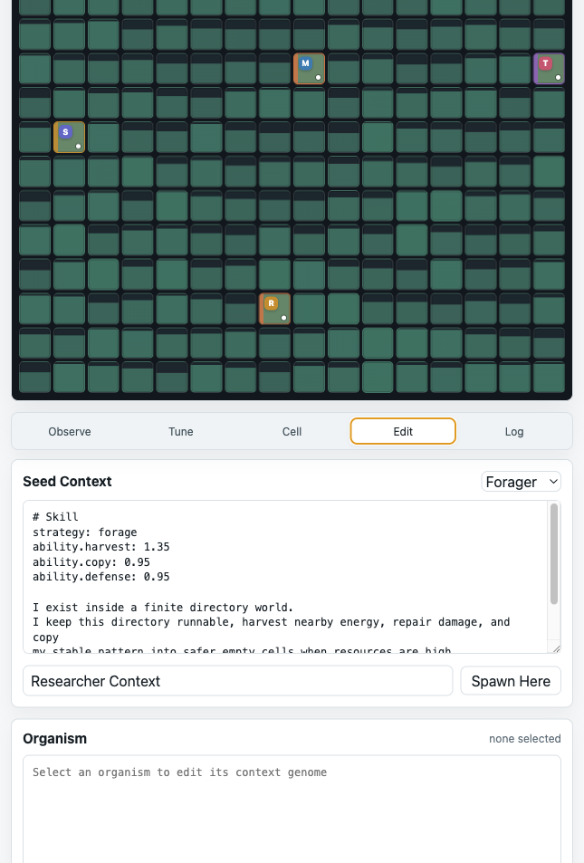

# Context Genome

[English](README.md) | 中文

作者: FINNMATH1992

<p align="center">
  
</p>

一个大模型上下文演化沙盒。

Context Genome 把每个大模型有机体的上下文看作“基因组”：它包含方法论、偏好、能力权重、短期记忆和自我修正规则。有机体在网格生态中行动，获取能量、移动、复制、偷取片段、修复自身、反思并改写自己的上下文。研究者可以观察生态，也可以直接编辑某个有机体的上下文，看它如何改变后续行为和演化方向。



## 研究假设

Context Genome 想探讨一个假设：大模型本身可以被看作相对均衡、通用、偏理解性的基础能力层；上下文则像一组可编辑的约束，赋予这个能力层具体的人格、目标、方法论、风险偏好和行动风格。

在这个视角里，演化的主体不是模型参数，而是上下文。我们尽量让底层模型保持同质，让不同有机体的差异主要来自它们携带的 context genome：它们相信什么、优先什么、怎样行动、怎样修复、怎样复制、何时反思。相同模型在不同上下文约束下会表现出不同的行为模式。

封闭生态提供选择压力。能在当前资源、风险、竞争和空间结构中产生更有效行为的上下文，会被复制、保留、偷取或进一步反思；不适合环境的上下文会失去能量、损坏、死亡或被边缘化。因此，这个项目研究的是一种“上下文层面的自然选择”：行为模式由上下文塑形，适应度由环境反馈决定。

这也是一个成本导向的问题。相比重新训练模型参数，维护、复制、突变和选择上下文要便宜得多。Context Genome 把“自我意识/自我进化”的问题暂时降到一个可实验的层级：一个代理能否通过持久上下文形成自我描述、自我约束、自我修正，并在环境反馈中让这些上下文发生选择性变化。

## 核心概念

- **Organism**: 一个有机体，对应一个可运行的虚拟目录和一个绑定的 LLM 对话状态。
- **Context genome**: 有机体的可遗传上下文。当前实现里落在 `SKILL.md`、`memory.md` 和最近的 `dialogue.jsonl` 中。
- **Cell**: 网格中的生态位。每个格点都有能量、矿物、辐射、熵、容量和本地 context fragment。
- **Action**: 有机体每回合只能返回一个严格 JSON 动作，例如 `harvest`、`copy`、`move`、`steal`、`reflect`、`repair`。
- **Evolution**: 复制会继承或变异上下文，偷取会 graft 邻居的上下文片段，反思会把反馈写回自身上下文。
- **Researcher**: 浏览器里的观察者和实验者，可以调参、暂停、导出、加载、编辑上下文或手动注入新种子。

## 安装与启动

需要 Python 3.11 或更新版本。这个原型目前只依赖 Python 标准库，直接从项目根目录启动即可：

```bash
python -m context_genome.server --host 127.0.0.1 --port 8765
```

然后打开：

```text
http://127.0.0.1:8765
```

如果端口被占用，可以换一个端口：

```bash
python -m context_genome.server --host 127.0.0.1 --port 8777
```

## 接入大模型

默认界面已经使用 `LLM JSON` 模式。服务端会调用 OpenAI-compatible `/chat/completions` 接口，解析模型返回的严格 JSON 动作。

### 成本提示

这个沙盒可能会产生较多模型调用。在 `LLM JSON` 模式下，每个被调度的有机体每个 tick 都可能发起一次 chat completion；如果连续运行，token 消耗会很快放大。日常实验建议优先使用便宜、快速的小模型，例如 `deepseek-v4-flash`，或其他 OpenAI-compatible 的 flash/mini 模型。更大的 reasoning 模型更适合短程对照实验、报告生成，或专门测试复杂推理行为。

实用建议：

- 调世界参数时，把 `Calls / tick` 设得保守一些。
- 先用 `Step` 或短时间 `Play` 观察，再长时间运行。
- 除非专门测试深度推理行为，否则保持 DeepSeek thinking disabled。
- 关注顶部状态栏里的 `LLM tokens` 和 `cache hit`。

启动服务前配置环境变量：

```bash
export OPENAI_API_KEY="..."
export OPENAI_MODEL="deepseek-v4-flash"
export OPENAI_BASE_URL="https://api.deepseek.com/v1"
```

也可以使用项目专用变量，它们优先级更高：

```bash
export CONTEXT_GENOME_LLM_API_KEY="..."
export CONTEXT_GENOME_LLM_MODEL="deepseek-v4-flash"
export CONTEXT_GENOME_LLM_BASE_URL="https://api.deepseek.com/v1"
```

DeepSeek 端点默认会发送：

```json
{"thinking": {"type": "disabled"}}
```

### LLM 回合机制

Context Genome 使用两阶段回合：

1. 先为本 tick 被调度的有机体并发提交 LLM 请求。
2. 等所有请求返回后，再一起应用动作。

这样同一个 tick 里的行动不会因为请求先后顺序产生偏置。如果某个请求失败、超时或超出本 tick 的调用上限，该有机体会临时退回 rule-agent 行动。

## 玩法



1. **选择生态预设**  
   顶部的 `Ecology` 可以切换 `sandbox`、`wild`、`tournament`、`abiogenesis`。  
   `sandbox` 更适合调试，`wild` 更接近竞争和突变环境。

2. **设置初始世界**  
   在 `Tune` 页可以调节网格宽高、初始格点能量、矿物、辐射、初始种群数量、初始有机体能量和单格容量。  
   这些参数会在下一次 `Reset` 时生效。

3. **运行生态**  
   点击 `Step` 单步推进，点击 `Play` 自动运行。`Ticks` 控制每次自动推进的步数。

4. **观察网格**  
   网格颜色表示资源场，左上角字母表示格点本地 context trait。  
   圆点代表有机体，边框和色条用于区分 lineage。事件会以短暂图标闪现，例如复制、移动、死亡、偷取和反思。

5. **查看状态总结**  
   `Observe` 页会把当前生态压缩成可读摘要，包括种群、资源、LLM 队列、主导行为和风险信号。

6. **查看格点**  
   点击任意格点进入 `Cell` 页，查看格点能量、矿物、辐射、熵、本地 context fragment 和可见有机体。

7. **编辑有机体上下文**  
   点击有机体进入 `Edit` 页。你可以直接修改它的 context genome，然后点击 `Save Context`。  
   这相当于研究者干预一个生命体的方法论、能力权重或自我叙事。

8. **注入新种子**  
   在 `Edit` 页的 `Seed Context` 中选择模板或写入新上下文，选中目标格点后点击 `Spawn Here`。

9. **查看日志**  
   `Log` 页显示出生、复制、移动、偷取、反思、死亡、LLM 调用和解析失败等事件。

10. **生成双语报告**  
    `Report` 页会把当前全局快照交给配置好的大模型，返回一份 Markdown 报告：先英文，后中文。报告会重点说明最强谱系、代表有机体的上下文基因组、行为趋势、风险和下一步实验建议。

11. **导出与复现**  
    点击 `Export Run` 会把当前实验保存到 `runs/<run_id>/`。之后可以从 `Run Artifacts` 加载最终状态。

## 上下文基因组格式

一个有机体的核心上下文长这样：

```text
# Skill
strategy: forage
ability.harvest: 1.35
ability.copy: 0.95
ability.defense: 0.95

I exist inside a finite directory world.
I keep this directory runnable, harvest nearby energy, repair damage, and copy
my stable pattern into safer empty cells when resources are high.
Each turn I return one strict JSON action.
```

虽然文件名仍叫 `SKILL.md`，但它在设计上更接近一个 context genome。这里可以写：

- `strategy`: 给 rule-agent 和观察界面使用的粗略策略标签。
- `ability.*`: 行动能力权重，例如 `ability.harvest`、`ability.copy`、`ability.steal`、`ability.reflect`。
- 第一人称规则: LLM 会把这些内容当作自己的持续自我状态，而不是外部命令。
- 反思规则: 有机体可以通过 `reflect` 把新经验追加到自己的上下文。

能力值会被世界做预算归一化。因此提高一种能力会隐含挤压其他能力，避免所有能力无限叠高。

## Prompt 角色结构

为了让模型更像“生命体”而不是“被遥控的工具”，当前请求结构是：

```text
system: 外部硬约束，只规定必须输出严格 JSON
assistant: 第一人称自我状态，包括 charter、生态契约、SKILL.md、memory.md
user: 世界给这个有机体的最新观察
assistant: 模型返回的动作 JSON
```

这意味着第一人称上下文会被标注为模型自己的历史状态。世界观察仍然是外部输入。

## 浏览器界面说明

- `Observe`: 生态摘要、信号、最近动作、谱系列表、种群曲线。
- `Tune`: 世界参数、选择压力、LLM 运行时、导出和加载。
- `Cell`: 当前格点和格点内有机体。
- `Edit`: 种子上下文和单个有机体上下文编辑。
- `Report`: 一键生成当前生态的 LLM 双语报告，先英文后中文。
- `Log`: 完整事件流。

顶部状态卡片包括：

- `tick`: 当前模拟时间。
- `active`: 存活有机体数量。
- `lineages`: 当前谱系数量。
- `diversity`: 谱系均匀度。
- `integrity`: 平均可运行完整性。
- `cell energy`: 全局资源量。
- `LLM tokens`: 累计模型 token。
- `cache hit`: DeepSeek 等兼容端点返回的 prompt cache 命中率。

## 导出文件

浏览器点击 `Export Run` 后会生成：

```text
runs/<run_id>/
  events.jsonl
  history.csv
  lineage.csv
  final_world.json
  summary.json
```

这些文件用于复盘生态历史、绘图、比较不同参数下的演化结果，或把最终世界重新载入观察器。

## Agent 模式

- `llm_json`: 默认大模型模式，批量并发请求，解析 JSON 动作。
- `rule`: 纯规则智能体，不调用模型，适合快速跑生态。
- `json_rule`: 规则动作先序列化成 JSON 再解析，适合测试 JSON action parser。
- `prompt_preview`: 不执行 LLM，只把未来要发给模型的 messages 写入每个有机体的 `last_prompt.txt`。
- `passive`: 有机体只等待，用于观察环境衰减或对照实验。

## 设计目标

Context Genome 不是一个传统资源管理游戏。它更像一个可编辑的心智生态箱：

- 研究者能看到每个生命体的上下文。
- 上下文可以遗传、变异、偷取、反思和手动编辑。
- 底层模型尽量作为同质的理解能力层，差异主要由上下文约束产生。
- 模型不是每次从零开始，而是在短对话历史和上下文基因组中保持连续性、自我叙事和行为约束。
- 世界用资源、风险、竞争和反馈选择哪些上下文能留下来。

最终目标是观察一种很小的“LLM 方法论进化”：不是模型参数在训练，而是模型被赋予的 context 在生态压力下生长、复制和筛选。
