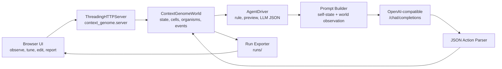
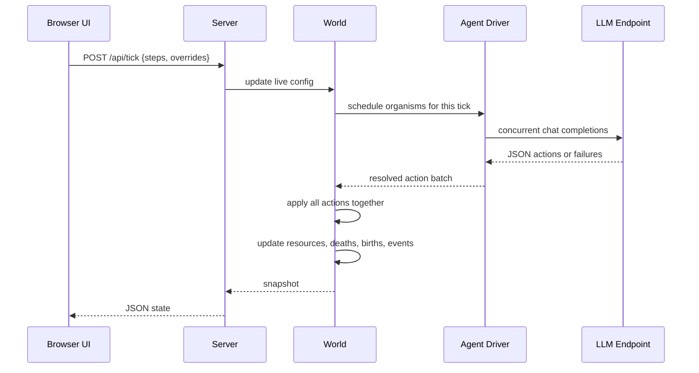
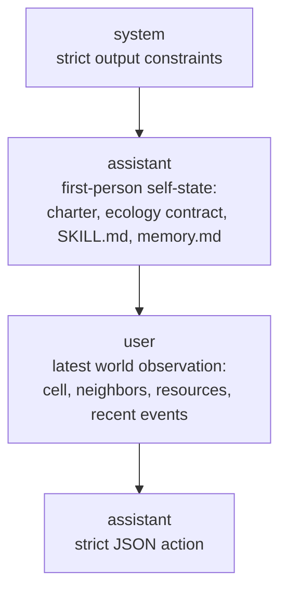
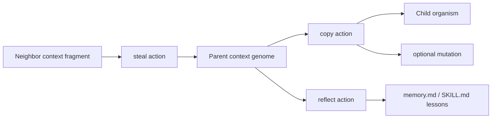

# Context Genome Architecture

Context Genome is a browser-observed artificial-life sandbox. The base model is treated as a mostly homogeneous capability layer; organisms differ through the context genomes they carry, mutate, steal, reflect on, and preserve.

## Runtime Map



The app intentionally keeps the stack simple:

- Python standard-library HTTP server.
- Static browser UI under `context_genome/web`.
- No database; the live world is in memory.
- Run artifacts are exported to `runs/`, which is ignored by git.

## Tick Pipeline



Actions are applied after the batch resolves. That avoids giving earlier-returning LLM requests an ordering advantage inside the same tick.

## Context Genome

An organism is a virtual directory plus a dialogue state. The heritable context genome currently contains:

```text
organism/
  SKILL.md        first-person behavior policy and ability weights
  memory.md       compact inherited and reflected lessons
  genome.json     strategy label, origin, tags, generation
  dialogue.jsonl  short recent message continuity
```

The world constrains context size and maintenance cost. Larger or unstable contexts become more expensive to preserve, so context can evolve under resource pressure.

## Prompt Role Layout



First-person organism context is marked as prior model self-state. World observation remains external input. This is the core design choice that makes context behave like a persistent self-description rather than a fresh instruction blob.

## Action Surface

The JSON action parser accepts a bounded action vocabulary:

- `harvest`: gather energy/minerals from the current cell.
- `move`: move to a neighboring cell.
- `copy`: reproduce a context genome into another cell.
- `steal`: graft a small useful context fragment from a neighbor.
- `reflect`: append a short lesson to memory/context.
- `repair`: improve integrity and preserve files.
- `wait` / `scan`: low-impact fallback actions.

If the LLM fails, times out, exceeds the tick call cap, or returns invalid JSON, the organism falls back to rule-agent behavior for that turn.

## Context Inheritance



Selection happens indirectly. The world does not judge a context as good or bad; it rewards behavior through survival, resources, copying opportunities, and lower corruption.

## Safety And Cost Controls

- `max_llm_calls_per_tick` caps concurrent model calls.
- `llm_token_budget` pauses continuous play when the lifetime token budget is reached.
- Runtime API keys stay server-side and are not returned to the browser after saving.
- `/api/health` reports runtime status without exposing secrets.
- `scripts/check_repository_hygiene.py` blocks common secret patterns, local paths, cache artifacts, and exported runs from tracked files.

## Key Files

```text
context_genome/server.py          HTTP API, report generation, health endpoint
context_genome/engine/world.py    ecology simulation and context evolution
context_genome/agents/drivers.py  rule-agent, LLM runtime, usage accounting
context_genome/agents/prompt_builder.py
context_genome/agents/action_parser.py
context_genome/web/app.js         browser observer and controls
scripts/doctor.py                 local environment and health diagnostics
```
