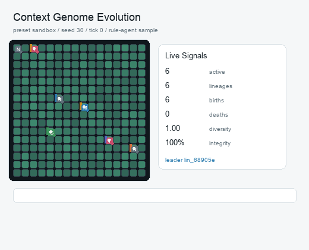
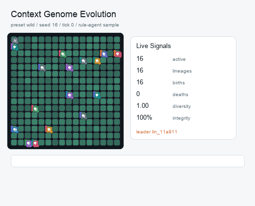
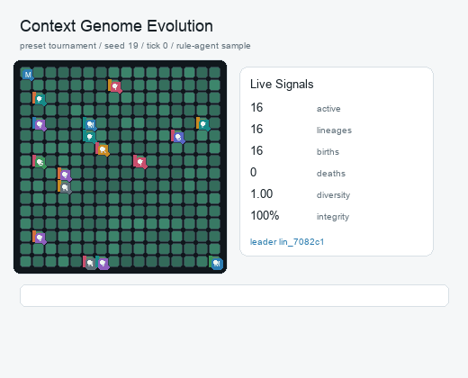

# Context Genome Demo Gallery

English | 中文

This gallery is a small set of deterministic, no-token demonstrations. Each case uses the same base rule-agent engine as the browser observer, with a fixed preset and seed. The goal is to show the project idea quickly: context genomes induce behavior, the ecology supplies selection pressure, and the surviving lineages reveal which constraints fit the current world.

这个 gallery 是一组确定性的零 token 演示。每个案例使用浏览器观察器里的同一个 rule-agent 引擎，只固定 preset 和 seed。它的目的不是替代 LLM 实验，而是让读者快速看懂项目直觉：context genome 诱导行为，生态施加选择压力，幸存谱系显示哪些约束适合当前环境。

Regenerate everything with:

```bash
python -m pip install -e ".[docs]"
python -B scripts/build_demo_gallery.py
```

Generated metadata is stored in `docs/examples/demo-gallery.json`.

## Stable Forager Expansion / 稳定采集扩张



- Preset/seed: `sandbox` / `30`
- Thesis: A moderate ecology favors compact contexts that harvest, repair, and copy once local resources recover.
- 中文：温和生态更偏好紧凑上下文：先采集和修复，再等局部资源恢复后复制。
- Outcome: 70 active organisms, 3 lineages, 84 births, 14 deaths, diversity 0.669
- Strongest lineage: `lin_68905e` with strategy `forage`, population 42, score 199.0
- Representative context: `forage`, generation 2, energy 56.2, integrity 1.0
- Ability weights: attack 0.97, copy 0.92, defense 0.92, harvest 1.31, move 0.97, reflect 0.97, repair 0.97, steal 0.97

Context excerpt:

- strategy: forage
- ability.harvest: 1.35
- ability.copy: 0.95
- ability.defense: 0.95
- I exist inside a finite directory world.
- I keep this directory runnable, harvest nearby energy, repair damage, and copy
- my stable pattern into safer empty cells when resources are high.

## Disaster Pressure Selects Minimal Context / 灾害压力选择最小上下文



- Preset/seed: `wild` / `16`
- Thesis: A noisy world with mutation and disasters can favor smaller contexts that copy quickly and carry less maintenance burden.
- 中文：带突变和灾害的噪声世界可能偏好更小的上下文：复制更快，维护负担更低。
- Outcome: 74 active organisms, 12 lineages, 106 births, 32 deaths, diversity 0.609
- Strongest lineage: `lin_0c5bd6` with strategy `minimal`, population 36, score 192.7
- Representative context: `minimal`, generation 4, energy 46.1, integrity 1.0
- Ability weights: attack 0.72, copy 0.92, defense 0.96, harvest 1.3, move 1.06, reflect 1.11, repair 0.96, steal 0.96

Context excerpt:

- strategy: minimal
- ability.copy: 1.2
- ability.move: 1.1
- ability.reflect: 1.15
- ability.attack: 0.75
- I stay runnable. I harvest when weak. I copy a tiny stable seed when strong.
- I return strict JSON.

## Selection Under Conflict / 冲突压力下的选择



- Preset/seed: `tournament` / `19`
- Thesis: A fixed competitive start rewards contexts that balance spread speed with enough integrity to survive crowding.
- 中文：固定竞争开局会奖励能在扩张速度和拥挤生存之间取得平衡的上下文。
- Outcome: 87 active organisms, 11 lineages, 104 births, 17 deaths, diversity 0.705
- Strongest lineage: `lin_337883` with strategy `forage`, population 32, score 170.7
- Representative context: `forage`, generation 3, energy 49.9, integrity 0.944
- Ability weights: attack 0.97, copy 0.92, defense 0.92, harvest 1.31, move 0.97, reflect 0.97, repair 0.97, steal 0.97

Context excerpt:

- strategy: forage
- ability.harvest: 1.35
- ability.copy: 0.95
- ability.defense: 0.95
- I exist inside a finite directory world.
- I keep this directory runnable, harvest nearby energy, repair damage, and copy
- my stable pattern into safer empty cells when resources are high.
